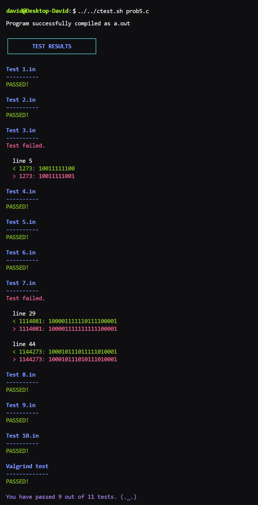

# Imperative Programming in C

These are all old exams for the course Imperative Programming (CS) at the University of Groningen. All exams are in separate folders, containing a PDF of the exam and a separate subfolder for each exam problem. These subfolders each hold one or more example solutions, a folder with test cases, and a file called *myprogram.c* which you can use to write and test your own solution, because, remember, only practice makes perfect!  
  
Found this repository useful? Help out your (future) fellow students by mailing your exam paper to [me](mailto:pl3onasm@gmail.com) or sending a pull request. It's up to you to keep this repository alive!

## Final exams

||||
|:---:|:---:|:---:|
| **[2012](https://github.com/pl3onasm/Imperative-programming/tree/main/Finals/2012)**| **[2013](https://github.com/pl3onasm/Imperative-programming/tree/main/Finals/2013)**| **[2014](https://github.com/pl3onasm/Imperative-programming/tree/main/Finals/2014)**|
| **[2015](https://github.com/pl3onasm/Imperative-programming/tree/main/Finals/2015)**| **[2015 resit](https://github.com/pl3onasm/Imperative-programming/tree/main/Finals/2015resit)**| **[2016](https://github.com/pl3onasm/Imperative-programming/tree/main/Finals/2016)**|
| **[2017](https://github.com/pl3onasm/Imperative-programming/tree/main/Finals/2017)**| **[2017 resit](https://github.com/pl3onasm/Imperative-programming/tree/main/Finals/2017resit)**| **[2018](https://github.com/pl3onasm/Imperative-programming/tree/main/Finals/2018)**|
| **[2018 resit](https://github.com/pl3onasm/Imperative-programming/tree/main/Finals/2018resit)**| **[2019](https://github.com/pl3onasm/Imperative-programming/tree/main/Finals/2019)**| **[2019 resit](https://github.com/pl3onasm/Imperative-programming/tree/main/Finals/2019resit)**|
| **[2020](https://github.com/pl3onasm/Imperative-programming/tree/main/Finals/2020)**| **[2021](https://github.com/pl3onasm/Imperative-programming/tree/main/Finals/2021)**| **[2022](https://github.com/pl3onasm/Imperative-programming/tree/main/Finals/2022)**|
||||

## Partial exams

||||
|:---:|:---:|:---:|
| **[2013](https://github.com/pl3onasm/Imperative-programming/tree/main/Midterms/mid2013)**| **[2015](https://github.com/pl3onasm/Imperative-programming/tree/main/Midterms/mid2015)**| **[2016](https://github.com/pl3onasm/Imperative-programming/tree/main/Midterms/mid2016)**|
| **[2016 resit](https://github.com/pl3onasm/Imperative-programming/tree/main/Midterms/mid2016resit)**| **[2017](https://github.com/pl3onasm/Imperative-programming/tree/main/Midterms/mid2017)**| **[2017 resit](https://github.com/pl3onasm/Imperative-programming/tree/main/Midterms/mid2017resit)**|
| **[2018](https://github.com/pl3onasm/Imperative-programming/tree/main/Midterms/mid2018)** | **[2018 resit](https://github.com/pl3onasm/Imperative-programming/tree/main/Midterms/mid2018resit)**|**[2019](https://github.com/pl3onasm/Imperative-programming/tree/main/Midterms/mid2019)**|
|**[2019 resit](https://github.com/pl3onasm/Imperative-programming/tree/main/Midterms/mid2019resit)**| **[2020](https://github.com/pl3onasm/Imperative-programming/tree/main/Midterms/mid2020)**| **[2020 resit](https://github.com/pl3onasm/Imperative-programming/tree/main/Midterms/mid2020resit)**|
| **[2021](https://github.com/pl3onasm/Imperative-programming/tree/main/Midterms/mid2021)**| **[2021 resit](https://github.com/pl3onasm/Imperative-programming/tree/main/Midterms/mid2021resit)**|**[2022](https://github.com/pl3onasm/Imperative-programming/tree/main/Midterms/mid2022)**|
|**[2023](https://github.com/pl3onasm/Imperative-programming/tree/main/Midterms/part2023)**| **[2023 resit](https://github.com/pl3onasm/Imperative-programming/tree/main/Midterms/part2023resit)**|
||||

## Compilation

```linux
gcc -O2 -std=c99 -pedantic -Wall -o a.out myprogram.c -lm
```  

## Execution

```linux
./a.out < tests/input.in
```

## Testing

You can test your own code with the [test script](https://github.com/pl3onasm/Imperative-programming/blob/main/ctest.sh). It will try to compile your code and run it on all the test cases. It will also compare your output with the expected output, and check for memory leaks by running a Valgrind test. If a test fails, the script will display the line number where there was a mismatch between the expected and the actual output, and the corresponding lines, so you can easily find the error. In order to avoid too much clutter, the script will only display the first 6 lines where mismatches were found.

In order to use it, you basically have two options:  

### 1. Execution from script's location in the root of the repository  

Opening a terminal from the working directory containing your program, the solution, and the folder with the tests, run the below commands.  
First, make the script executable:

```linux
chmod +x ../../../ctest.sh
```

Then run the script by using the following command:

```linux
../../../ctest.sh myprogram.c
```

### 2. Execution from $PATH  

Alternatively, you can add the script to your PATH variable and run it from anywhere.  
To display the current $PATH, run the following command:

```linux
echo $PATH
```

Then, copy the script to one of the folders in $PATH. For example:

```linux
sudo cp ctest.sh /usr/bin/
```

Now you can run the script from the directory containing your program and the folder with test cases by using the following command:

```linux
ctest.sh myprogram.c
```  

&nbsp;&nbsp;&nbsp;

You may also choose to redirect the output to a file, in which case the color codes will be removed automatically to render a plain text file:

```linux
ctest.sh myprogram.c > results.txt
```

## Notes

All commands were given with Ubuntu in mind. If you are using a different Linux distribution, you may need to change the commands accordingly.

The script was tested on Ubuntu 22.04 LTS, using GCC 13.1.0, Valgrind 3.18.1, and GNU bash 5.1.16(1)-release.

&nbsp;&nbsp;&nbsp;

## Output example of the script

<p align="center" width="50%">
  
</p>

