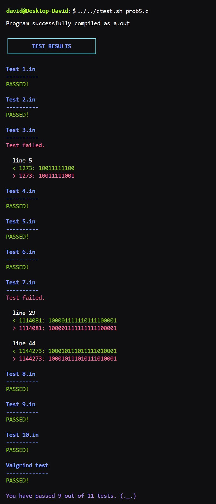

# ${\color{cadetblue} \text{Imperative Programming}}$

This repository contains old exams for the course Imperative Programming (IP) at the University of Groningen. In 2023, this course was merged with the course Program Correctness (PC) into the new course Programming Fundamentals (PF). This is why you will find exams for both courses in this repository. All exams were created by [dr. A. Meijster](https://www.rug.nl/staff/a.meijster/), and make for great practice material.

For the C questions, the subfolders each hold one or more example solutions, a folder with test cases, and a file called *myprogram.c* which you can use to write and test your own solution. For the proof questions, both exam questions and answers are given in Dafny.  
  
Found this repository useful? Help out your (future) fellow students by mailing your exam paper to [me](mailto:pl3onasm@gmail.com) or sending a pull request. It's up to you to keep this repository up to date!

## ${\color{darkgoldenrod}\text{IP Finals}}$

||||
|:---:|:---:|:---:|
| **[2012](IP-Finals/2012)**| **[2013](IP-Finals/2013)**| **[2014](IP-Finals/2014)**|
| **[2015](IP-Finals/2015)**| **[2015 resit](IP-Finals/2015resit)**| **[2016](IP-Finals/2016)**|
| **[2017](IP-Finals/2017)**| **[2017 resit](IP-Finals/2017resit)**| **[2018](IP-Finals/2018)**|
| **[2018 resit](IP-Finals/2018resit)**| **[2019](IP-Finals/2019)**| **[2019 resit](IP-Finals/2019resit)**|
| **[2020](IP-Finals/2020)**| **[2021](IP-Finals/2021)**| **[2022](IP-Finals/2022)**|
||||

## ${\color{darkgoldenrod}\text{IP Midterms}}$

||||
|:---:|:---:|:---:|
| **[2013](IP-Midterms/mid2013)**| **[2015](IP-Midterms/mid2015)**| **[2016](IP-Midterms/mid2016)**|
| **[2016 resit](IP-Midterms/mid2016resit)**| **[2017](IP-Midterms/mid2017)**| **[2017 resit](IP-Midterms/mid2017resit)**|
| **[2018](IP-Midterms/mid2018)** | **[2018 resit](IP-Midterms/mid2018resit)**|**[2019](IP-Midterms/mid2019)**|
|**[2019 resit](IP-Midterms/mid2019resit)**| **[2020](IP-Midterms/mid2020)**| **[2020 resit](IP-Midterms/mid2020resit)**|
| **[2021](IP-Midterms/mid2021)**| **[2021 resit](IP-Midterms/mid2021resit)**|**[2022](IP-Midterms/mid2022)**|
||||

## ${\color{darkgoldenrod}\text{PF 1-3 exams}}$

|||
|:---:|:---:|
|**[2023](PF1-3/exam1-2023)**| **[2023 resit](PF1-3/exam2-2023)**|
|||

## ${\color{darkgoldenrod}\text{PF 2-3 exams}}$

|||
|:---:|:---:|
|**[2023](PF2-3/exam2-2023)**| **[2023 resit](PF2-3/resit2-2023)** |
|||

## ${\color{darkgoldenrod}\text{PF 3-3 exams}}$

|||
|:---:|:---:|
|**[2024](PF3-3/exam3-2024)**||
|||

## ${\color{cadetblue}\text{Testing}}$

You can test your own C code with the [test script](https://github.com/pl3onasm/Imperative-programming/blob/main/ctest.sh). It will try to compile your code and run it on all the test cases. It will also compare your output with the expected output, and check for memory leaks by running a Valgrind test. If a test fails, the script will display the line numbers where a mismatch between the expected and the actual output was found, followed by the corresponding lines themselves, so you can easily spot the error. Lines in green and preceded by `<` represent the expected output, while lines in red and preceded by `>` are the actual (incorrect) output. In order to avoid too much clutter, the script will only display the first 5 lines where mismatches were found and will indicate how many more there are if applicable.

If you want to use the script, you basically have two options:  

### ${\color{rosybrown}\text{1. Execution from script's repo location}}$  

Opening a terminal from the working directory containing your program, the solution, and the folder with the tests, run the below commands.  
First, make the script executable:

```linux
chmod +x ../../../ctest.sh
```

Then run the script by using the following command:

```linux
../../../ctest.sh myprogram.c
```

### ${\color{rosybrown}\text{2. Execution from PATH}}$

Alternatively, you can add the script to your PATH variable and run it from anywhere.  
To display the current $PATH, run the following command:

```linux
echo $PATH
```

Then, copy the script to one of the folders in $PATH. If you have copied the script to the folder before, the command will simply overwrite the previous version. For example:

```linux
sudo cp ctest.sh /usr/bin/
```

Now you can run the script from the directory containing your program and the folder with test cases by using the following command:

```linux
ctest.sh myprogram.c
```  

&nbsp;&nbsp;&nbsp;

You may also choose to redirect the output to a file, in which case the color codes will be removed automatically to render a plain text file:

```linux
ctest.sh myprogram.c > results.txt
```

## ${\color{cadetblue}\text{Functions library}}$

The folder [functions](Functions) contains some useful function implementations in C. Have a look at the [header file](Functions/functions.h) to see which functions are available and how to use them.  

You can choose to include these functions in your own code, or use them as a reference to write your own implementation. If you want to work with these functions, you can do so by adding the include directive with the appropriate path. For example:

```c
#include "../../../Functions/functions.h"
```

Including the header file in this way will also make the test script compile your own code along with the functions from the library. Since the library is small, it is not necessary to work with a static or dynamic library.

## ${\color{cadetblue}\text{Notes}}$

All commands were given with Ubuntu in mind. If you are using a different Linux distribution, you may need to change the commands accordingly.

The script was tested on Ubuntu 22.04 LTS, using GCC 13.1.0, Valgrind 3.18.1, and GNU bash 5.1.16(1)-release.

If you want to compile and test your code manually, you can use the following commands:

```linux
gcc -O2 -std=c99 -pedantic -Wall -o a.out myprogram.c -lm
valgrind --leak-check=full ./a.out < tests/input.in
```

&nbsp;&nbsp;&nbsp;

## ${\color{cadetblue}\text{Output example of the script}}$

<p align="center" width="50%">
  
</p>
